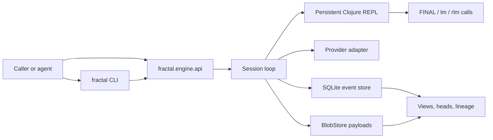

# fractal-engine

fractal-engine is a recursive language-model compute engine for long-context,
long-horizon work. A root model drives a persistent Clojure REPL, writes fenced
Clojure, receives compact host observations, and continues until it calls
`(FINAL value)`.

The engine is built as a Clojure SDK plus an agent-operable CLI/control plane.
It is not a consumer chat app and not a repository-analysis product. It is a
small runtime substrate for durable model-driven work:

- exact work happens in Clojure;
- bounded judgment happens through `lm` and `map-lm`;
- recursive work happens through child sessions via `rlm` and `map-rlm`;
- reusable prior state is derived through `attach-rlm`;
- durable state is stored in SQLite plus content-addressed payload blobs;
- every completed turn publishes an immutable head for resume and lineage.



## Capabilities

The public Clojure facade is `fractal.engine.api`. The CLI facade is
`fractal.engine.cli`, exposed by `clojure -M:cli` and by the `bin/fractal`
wrapper.

| Capability | What it gives you |
| --- | --- |
| Persistent sessions | A model works inside a durable Clojure session whose vars can survive turns and process restarts. |
| Exact host work | Model-written fenced Clojure runs in a capability-clamped SCI context and returns compact observations. |
| Provider adapter seam | Offline fake runs and live provider runs share the same runtime path. |
| Recursive harness | `lm`, `map-lm`, `rlm`, `map-rlm`, and `attach-rlm` let the model choose bounded leaf judgment, child sessions, fan-out, or derived continuation. |
| Durable storage | SQLite stores events and session rows; BlobStore stores content-addressed payload bytes. |
| Immutable heads | Completed turns publish continuation heads used by resume, attach, and lineage inspection. |
| Agent control plane | The CLI drives usage commands and read-only inspection commands with JSON/EDN output and explicit config files. |

## Requirements

- JDK 21 or newer
- Clojure CLI

Check locally:

```sh
java -version
clojure --version
```

## Quick Start: CLI, Offline

Create a local config file and durable store. This uses the fake adapter, so it
does not need provider credentials, network access, or paid calls.

```sh
clojure -M:cli init \
  --config fractal.edn \
  --store-dir .fractal/sessions/demo \
  --session demo
```

Run one turn and inspect the result:

```sh
clojure -M:cli run \
  --config fractal.edn \
  --session demo \
  --message "return a small value" \
  --pretty

clojure -M:cli report \
  --config fractal.edn \
  --session demo \
  --pretty
```

Trace the model code and engine observations for the latest turn:

```sh
clojure -M:cli trace \
  --config fractal.edn \
  --session demo \
  --pretty
```

The default CLI output is JSON. Use `--edn` when exact Clojure-shaped values
matter, especially payload refs:

```sh
clojure -M:cli turns --config fractal.edn --session demo --edn
```

## Quick Start: SDK, Offline

```clojure
(require '[fractal.engine.api :as fe])

(def cfg
  (fe/make-config
    {:adapter :fake
     :model "fake-model"
     :capability :default
     :fake/respond
     (fe/responder
       [[:default "```clojure\n(FINAL {:answer 42})\n```"]])}))

(def session (fe/start-session! cfg))
(def result (fe/run-turn! session "What is 6 times 7?"))

(:status result)
;; => :final

(:turn/final-value result)
;; => {:answer 42}

(fe/stop-session! session)
```

## Durable Sessions

Use `:store :sqlite` and a relative `:store/dir` when a session should survive
process restart:

```clojure
(def cfg
  (fe/make-config
    {:adapter :fake
     :model "fake-model"
     :capability :default
     :store :sqlite
     :store/dir ".fractal/sessions/sdk-demo"
     :fake/respond
     (fe/responder
       [["define" "```clojure\n(def remembered 7)\n(FINAL :defined)\n```"]
        ["use" "```clojure\n(FINAL (* remembered 6))\n```"]])}))

(def first-handle (fe/start-session! cfg {:id "sdk-demo"}))
(fe/run-turn! first-handle "define")
(fe/close-session! first-handle)

(def reopened (fe/resume-session! cfg "sdk-demo"))
(:turn/final-value (fe/run-turn! reopened "use"))
;; => 42
```

Resume restores from the published current head. It does not replay provider
calls or old evals.

## Recursive Harness

Set `:harness :rlm` to expose the recursive model-facing surface inside the
session REPL:

```text
FINAL
lm
map-lm
rlm
map-rlm
attach-rlm
```

The outer SDK and CLI call shape stays the same. The model decides whether to
use ordinary Clojure, a bounded leaf call, or a child session.

Use the smallest sufficient kind:

- Clojure for parsing, counting, grouping, joining, validation, and final shape
  construction.
- `lm` / `map-lm` for bounded semantic judgments.
- `rlm` / `map-rlm` for subproblems that need their own loop and state.
- `attach-rlm` to derive a fresh child from a selected prior head without
  advancing the source session.

## SDK Surfaces

Embedders can inject named world/API surfaces into the session REPL:

```clojure
(def issues-surface
  {:surface/id :issues
   :surface/version 1
   :surface/prompt "Use issues/search before guessing issue ids."
   :surface/prompts
   {:request (fn [_ctx] "Current issue index is fresh as of this request.")
    :leaf "Classify issue snippets by severity only."}
   :surface/namespaces
   {'issues {'search {:doc "Search issue records."
                      :arglists '([query opts])
                      :fn (fn [query opts] {:query query :limit (:limit opts)})}}}})

(def issues-profile
  {:capability/name :issues-demo
   :cap/fs-read :deny
   :cap/fs-write :deny
   :cap/shell :deny
   :cap/network :deny
   :ns/granted '#{clojure.core clojure.string clojure.edn clojure.set clojure.walk}
   :cap/java-classes {}
   :engine-fns #{:FINAL :inspect :lm :map-lm :rlm :map-rlm :attach-rlm}
   :surface/fns '#{issues/search}})

(def cfg
  (fe/make-config
    {:adapter :fake
     :model "fake-model"
     :harness :rlm
     :surfaces [issues-surface]
     :capability issues-profile
     :fake/respond (fe/responder
                     [[:default "```clojure\n(FINAL (issues/search \"auth\" {:limit 3}))\n```"]])}))
```

Surface functions are injected as namespaced calls only, for example
`(issues/search "auth" {:limit 3})`. They are deny-by-default through
`:surface/fns`, and child sessions inherit them by set intersection. Stable
surface cards are part of the system prompt; dynamic `:request` prompt fragments
are added per provider request outside persisted transcript state, and reduce
tail-cache breakpoints so dynamic text does not become a cache anchor.

## CLI Surface

Run:

```sh
clojure -M:cli <command> [options] [args]
```

or build the wrapper target and call:

```sh
bin/fractal <command> [options] [args]
```

Usage commands:

```text
init config start run turn resume stop close compact wait
```

Inspection commands:

```text
status progress view events heads head edges tree payload messages turns steps evals trace check report
pins facts delegation
```

The CLI is designed for agents and scripts first. It is non-interactive by
default, uses explicit config files and session ids, emits structured output, and
keeps payload hydration explicit.

Full CLI docs: [`docs/AGENT_CONTROL_PLANE.md`](docs/AGENT_CONTROL_PLANE.md).

## Live Providers

Provider-backed runs use `:adapter :sdk`, a provider id, model ids, and provider
configuration supplied by your runtime environment or local secret manager. Keep
credentials out of tracked files.

For live recursion, configure the runtime governor explicitly:

```edn
{:adapter :sdk
 :provider :provider-key
 :model "root-model-id"
 :harness :rlm
 :child-model "child-model-id"
 :leaf-model "leaf-model-id"
 :store :sqlite
 :store/dir ".fractal/sessions/live-demo"
 :max-steps 8
 :max-turns 4
 :call-timeout-ms 90000
 :max-fanout 4
 :fanout-pool 2
 :leaf-concurrency 2
 :cache-ttl "5m"}
```

Live validation is opt-in and may spend money. See
[`docs/LIVE_VALIDATION.md`](docs/LIVE_VALIDATION.md).

## Sandbox And Runtime Governance

Model-written Clojure runs inside a capability-clamped SCI context. The built-in
profiles are:

- `:locked-down`: no filesystem, shell, network, interop, or recursive model
  egress beyond `FINAL` / `inspect`;
- `:default`: read-only access to the work area, a small read-only shell command
  allowlist, no writes, no network, no Java interop, and the recursive host
  functions when `:harness :rlm` is enabled;
- `:trusted`: broader local-use profile for callers that intentionally allow
  work-area writes, shell, and network.

Capability overrides are clamped so a child or per-session override cannot widen
the parent profile. The sandbox also gates `slurp`, `spit`, `file-seq`,
`clojure.java.io` readers/streams/copy, `clojure.java.shell/sh`, namespace
access, reader eval, dangerous classes, and known escape symbols.

Eval results are realized (bounded) inside the eval guard: a lazy value whose
realization throws — `(take 5 unbound-var)`, a poisoned `map` — degrades into
the normal recoverable eval-error observation instead of killing the turn, and
a child session's realization failure stays the child's own eval error rather
than escaping to its parent. Unbounded/infinite seqs remain bounded throughout
(capped elements per seq), so forcing never hangs the kernel.

The runtime governor is also built. Configure it through:

- `:max-steps` for per-turn loop depth;
- `:max-turns` for session turn count;
- `:call-timeout-ms` for the wall-clock deadline around each adapter call and
  retry loop;
- `:max-fanout` for accepted `map-lm` / `map-rlm` width;
- `:fanout-pool` for bounded fan-out workers;
- `:leaf-concurrency` for the global leaf-call semaphore;
- `:context {:hard-at ...}` for hard context-window stops.

These controls produce explicit terminal outcomes such as `:timeout` and
`:budget-exceeded`. Provider usage/cost records, when available, are
observability metadata. The governor's job is to bound execution, not to become
a billing or accounting subsystem.

## Build And Release

Build the thin library jar:

```sh
clojure -T:build jar
```

Build the CLI uberjar:

```sh
clojure -T:build uber
java -jar target/fractal.jar help
```

Install the library jar into the local Maven repository:

```sh
clojure -T:build install
```

Release automation is tag-driven. Pushing a `v*` tag from a commit that contains
the release workflow will:

1. run the offline test suite;
2. build the library jar;
3. publish the library to Clojars using `CLOJARS_USERNAME` and
   `CLOJARS_PASSWORD` repository secrets;
4. build and smoke-test the CLI uberjar;
5. create a GitHub release with `target/fractal.jar`.

The release version is derived from the tag name without the leading `v`.

## Use As A Dependency

After a release is published, depend on the Clojars coordinate:

```clojure
{:deps {net.clojars.deadmeme5441/fractal-engine {:mvn/version "0.6.0"}}}
```

Then use the public facade:

```clojure
(require '[fractal.engine.api :as fe])
```

Do not depend on internal runtime namespaces unless you are contributing to the
engine itself.

## Validate

Default offline gate:

```sh
clojure -M:test
git diff --check
```

Optional live suite:

```sh
clojure -M:live-test
```

The default test alias excludes `^:live` tests and should not make network calls
or require credentials.

## Project Map

- [`src/fractal/engine/api.clj`](src/fractal/engine/api.clj): public SDK facade.
- [`src/fractal/engine/cli.clj`](src/fractal/engine/cli.clj): agent CLI facade.
- [`docs/`](docs/): public maintainer and user documentation.
- [`spec/`](spec/): architecture record and design rationale.
- [`test/fractal/engine/`](test/fractal/engine/): offline and opt-in live tests.

Recommended docs:

- [`docs/README.md`](docs/README.md): v1 overview.
- [`docs/GETTING_STARTED.md`](docs/GETTING_STARTED.md): SDK and CLI walkthrough.
- [`docs/API.md`](docs/API.md): public API reference.
- [`docs/AGENT_CONTROL_PLANE.md`](docs/AGENT_CONTROL_PLANE.md): CLI contract.
- [`docs/ARCHITECTURE.md`](docs/ARCHITECTURE.md): runtime architecture.
- [`docs/STORAGE_AND_HEADS.md`](docs/STORAGE_AND_HEADS.md): storage and heads.
- [`docs/RECURSION.md`](docs/RECURSION.md): recursion semantics.
- [`docs/TESTING.md`](docs/TESTING.md): validation guide.

## Scope And Limitations

- The in-process SCI capability sandbox is built and covered by regression
  tests, but it is not an OS/container isolation boundary for hostile code.
- The runtime governor bounds steps, turns, adapter deadlines, fan-out, leaf
  concurrency, and context-window exhaustion. Provider usage/cost accounting is
  observability metadata for audit and reporting.
- No vector retrieval or long-term memory layer.
- No S3/AWS storage backend.
- Live verification quality depends on the configured model.

## License

Apache-2.0. See [`LICENSE`](LICENSE).
