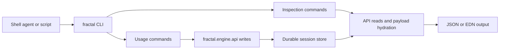

# Agent Control Plane

The agent control plane is the command-line surface for driving
`fractal.engine.api` from shell-accessible agents while a human can inspect the
state it leaves behind. It is intentionally not a consumer terminal product. It
is a process seam: explicit inputs, structured outputs, durable ids, and
readback commands that expose the engine's own projections.

Run it with:

```sh
clojure -M:cli <command> [options] [args]
```

The implementation lives in `fractal.engine.cli` and stays thin over
`fractal.engine.api`. It does not add product nouns, task templates, hidden
memory, or a second runtime model.

## Audience And Boundary

The primary consumer is an automation agent with shell access. The supervising
human should be able to inspect command output, config files, durable session
state, events, heads, lineage, and payload refs without depending on hidden
process state.

The seam is:

- JSON-first;
- non-interactive by default;
- resumable from explicit durable session ids;
- explicit about writes and provider calls;
- stable enough for scripts;
- readable enough for human audit with `--pretty` and `report`;
- exact enough for Clojure-shaped refs with `--edn`.

Human-friendly tools can be layered above this. The default contract remains
structured output.

## Source Of Truth

The Clojure API owns engine behavior:

- `make-config`
- `start-session!`
- `run-turn!`
- `run-turn-async!`
- `resume-session!`
- `stop-session!`
- `close-session!`
- `compact-session!`
- `view`
- `progress`
- `event-stream`
- `events-since`
- `read-payload`
- `subscribe!`

CLI commands open or create a durable SDK session, perform one usage or
inspection action, emit JSON or EDN, and close local resources. If a behavior is
not expressible through the public API, it does not belong in the CLI until the
API owns it.

Model-facing host functions are runtime functions available to the model under
the selected harness and capability profile. They are not top-level CLI
commands:

```text
FINAL
lm
map-lm
rlm
map-rlm
attach-rlm
```

## Command Families

The CLI has two command families.



Usage commands create, resume, mutate, or close durable runtime state:

| Command | Purpose |
| --- | --- |
| `init` | Create an EDN config reference file and store directory. |
| `config` | Print resolved, redacted engine config. |
| `start` | Create a durable session if absent, otherwise report the existing session. |
| `run` | Start or resume a session, send one blocking turn, then close resources. |
| `turn` | Resume an existing session, send one blocking turn, then close resources. |
| `resume` | Verify that a durable session can reopen. |
| `stop` | Request stop on a durable session. |
| `close` | Reopen and immediately close resources. |
| `compact` | Force session compaction through the engine API. |
| `wait` | Block until the session is idle or terminal, polling the durable log — works against a turn driven by another process. `--wait-timeout-ms N` (default 600000), `--poll-ms N` (default 500); nonzero exit with `:timed-out true` on timeout. |

Inspection commands read durable state without making provider calls, except
where the engine API being invoked explicitly does work such as compaction:

| Command | Purpose |
| --- | --- |
| `status` | Compact counters and current session status. |
| `progress` | API progress projection. |
| `view` | Full folded engine view. |
| `events` | Durable events since `--since N`. |
| `heads` | All heads plus current-head id. |
| `head` | One head selected with `--head` or a positional id. |
| `edges` | Lineage edges for recursion and derived sessions. |
| `tree` | Known session tree assembled from durable lineage. |
| `payload` | Hydrate one payload ref supplied with `--ref` or a positional EDN ref. |
| `messages` | Folded message projection. |
| `turns` | Folded turn projection. |
| `steps` | Folded step projection. |
| `evals` | Folded eval projection. |
| `trace` | Hydrated assistant code and observation messages for one turn, plus final value when present. |
| `check` | Store sanity check for known sessions and payload refs. |
| `report` | Human-observable compact summary of the latest session state. |

`help` prints the command list and common options.

## Config Files

Use config files for normal operation. CLI flags are overrides, not the primary
configuration surface.

Flat config:

```edn
{:adapter :sdk
 :provider :provider-key
 :model "root-model-id"
 :harness :rlm
 :capability :default
 :store :sqlite
 :store/dir ".fractal/sessions/example"
 :child-model "child-model-id"
 :leaf-model "leaf-model-id"
 :max-steps 8
 :max-turns 4
 :call-timeout-ms 90000
 :max-fanout 4
 :fanout-pool 2
 :leaf-concurrency 2
 :cache-ttl "5m"}
```

Profile config:

```edn
{:default-profile :fake
 :profiles
 {:fake
  {:adapter :fake
   :model "fake-model"
   :harness :rlm
   :capability :default
   :store :sqlite
   :store/dir ".fractal/sessions/fake"
   :fake/respond [[:default "```clojure\n(FINAL {:ok true})\n```"]]}

  :live
  {:adapter :sdk
   :provider :provider-key
   :model "root-model-id"
   :harness :rlm
   :capability :default
   :store :sqlite
   :store/dir ".fractal/sessions/live"
   :child-model "child-model-id"
   :leaf-model "leaf-model-id"
   :max-steps 8
   :max-turns 4
   :call-timeout-ms 90000
   :max-fanout 4
   :fanout-pool 2
   :leaf-concurrency 2
   :cache-ttl "5m"}}}
```

Select profiles and sessions explicitly:

```sh
clojure -M:cli config --config fractal.edn --profile live --pretty
clojure -M:cli run --config fractal.edn --profile live --session demo --message-file prompt.md
```

Provider credentials should come from the provider SDK's runtime environment or
from local secret management outside the repository. Do not commit credential
values, credential file paths, cloud project ids, or machine-specific setup.

## Output Contract

JSON is the default because agents should not scrape prose:

```sh
clojure -M:cli status --config fractal.edn --session demo
```

Use `--pretty` for human-observed JSON:

```sh
clojure -M:cli report --config fractal.edn --session demo --pretty
```

Use `--edn` when exact Clojure-shaped values matter, especially payload refs
that will be passed back to `payload`:

```sh
clojure -M:cli turns --config fractal.edn --session demo --edn
clojure -M:cli payload --config fractal.edn --session demo --ref '{:fractal/ref :payload, ...}'
```

Successful commands emit one object with `:ok true` / `"ok": true`, the command
name, and command-specific fields. Errors emit one object with `ok false`,
`error/message`, `error/class`, and `error/data` when typed data is available.

JSON output stringifies EDN keyword keys and values. Namespaced keys are rendered
as strings such as `"session/id"` and `"turn/final-value"`. EDN output preserves
keywords and payload refs exactly.

## Usage Workflows

Create a reference config:

```sh
clojure -M:cli init --config fractal.edn --store-dir .fractal/sessions/demo --session demo
```

Run one blocking turn, creating the session if needed:

```sh
clojure -M:cli run --config fractal.edn --session demo --message-file prompt.md --pretty
```

Continue an existing session:

```sh
clojure -M:cli turn --config fractal.edn --session demo --message "continue from the current vars"
```

Force compaction and then inspect the summary:

```sh
clojure -M:cli compact --config fractal.edn --session demo
clojure -M:cli report --config fractal.edn --session demo --pretty
```

Stop and close:

```sh
clojure -M:cli stop --config fractal.edn --session demo
clojure -M:cli close --config fractal.edn --session demo
```

## Inspection Workflows

Read compact status:

```sh
clojure -M:cli status --config fractal.edn --session demo --pretty
```

Tail durable events from an event id:

```sh
clojure -M:cli events --config fractal.edn --session demo --since 42 --pretty
```

Inspect the current head:

```sh
head_id="$(clojure -M:cli heads --config fractal.edn --session demo | jq -r '.current-head')"
clojure -M:cli head --config fractal.edn --session demo --head "$head_id" --pretty
```

Read recursion lineage:

```sh
clojure -M:cli edges --config fractal.edn --session demo --pretty
clojure -M:cli tree --config fractal.edn --session demo --pretty
```

Hydrate a large final value:

```sh
clojure -M:cli turns --config fractal.edn --session demo --edn > turns.edn
# Extract a payload ref from the EDN projection, then:
clojure -M:cli payload --config fractal.edn --session demo --ref "$payload_ref" --pretty
```

Read the model-code / engine-observation trace for the latest turn:

```sh
clojure -M:cli trace --config fractal.edn --session demo --pretty
```

Run the local integrity check:

```sh
clojure -M:cli check --config fractal.edn --session demo --pretty
```

## Error Model

The CLI preserves the API's distinction between returned turn results and
preflight or command failures.

Returned turn outcomes live under the `result` field for `run` and `turn`:

- `:final`
- `:error`
- `:timeout`
- `:budget-exceeded`

Command failures return `ok false` and a non-zero exit code. Common typed
failures include:

- invalid config;
- profile not found;
- unsupported store;
- unknown session id;
- missing message;
- missing or unknown head id;
- invalid payload ref;
- unknown model or provider;
- session turn limit reached;
- turn already in flight;
- failed pre-turn compaction.

A completed turn with `:status :error` is different from a command that could
not open or address the session.

## Async Boundary

`run-turn-async!` exists in the API, but this CLI is process-per-command. The
`wait` command polls the durable event log (`read-state`), so it correctly
observes and settles on a turn owned by ANOTHER process writing to the same
store directory — without attaching to that process. Writing stays one process
per session; `wait` is read-only.

Background turn ownership belongs in a separate process-control adapter if this
repo grows one. The current CLI contract is explicit process-per-command usage:
write commands open or resume a session, perform one action, return structured
output, and release process-local resources.

## Public-Safe Output

The control plane should be safe to use in public logs and documentation.

Tracked files and committed reports must not include:

- absolute local paths;
- usernames or machine-identifying details;
- credential values;
- credential or auth file locations;
- cloud project ids;
- private organization or workplace terms;
- private ticket ids;
- unrelated private repository names;
- raw live-provider transcripts that may contain private input.

When paths are needed in examples, use relative ignored paths such as
`.fractal/...` or placeholders.

## Implementation Rule

Before adding a public control-plane behavior, answer these questions:

- Which `fractal.engine.api` call owns the behavior?
- What is the JSON shape?
- What ids let a caller resume, tail, or inspect it later?
- What is returned as a `TurnResult` versus reported as a preflight error?
- What payloads remain refs until explicitly hydrated?
- What public-safe redaction is required?
- What test proves non-interactive behavior?
- What live or dogfood run proves the command works through the shipped seam?

If any answer is unclear, the behavior is not ready for the public control-plane
surface.
