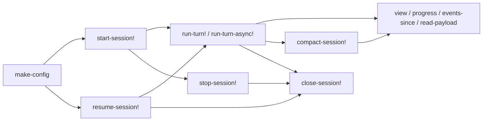

# API

`fractal.engine.api` is the supported Clojure SDK facade. It is the public
embedding surface for starting sessions, running turns, reading durable state,
subscribing to live events, hydrating payloads, and reopening durable sessions.

The facade is intentionally small. Model-facing host functions are injected into
session runtimes; they are not ordinary vars exported from this namespace.

## Public Namespace

```clojure
(require '[fractal.engine.api :as fe])
```



Exported functions:

```clojure
(fe/make-config opts)

(fe/start-session! cfg)
(fe/start-session! cfg opts)

(fe/run-turn! handle msg)
(fe/run-turn-async! handle msg)

(fe/resume-session! cfg sid)
(fe/resume-session! cfg sid opts)

(fe/stop-session! handle)
(fe/stop-session! handle opts)

(fe/close-session! handle)
(fe/compact-session! handle)

(fe/view handle)
(fe/progress handle)
(fe/event-stream handle)
(fe/events-since handle event-id)
(fe/read-payload handle ref-or-value)
(fe/subscribe! handle callback)

(fe/responder clauses)
```

`responder` is a fake-adapter helper for tests and local examples.

## CLI Facade

The command-line facade is `fractal.engine.cli`, exposed by the `:cli` alias:

```sh
clojure -M:cli <command> [options] [args]
```

It is a thin process-per-command wrapper over this API. The CLI should not be
used as a different semantic layer: `run` and `turn` call `run-turn!`, `resume`
reopens through `resume-session!`, `compact` calls `compact-session!`, readback
commands call `view`, `progress`, `events-since`, or `read-payload`, and config
resolution ends in `make-config`.

The CLI defaults to JSON for agent automation and supports `--edn` when callers
need exact Clojure values such as payload refs. Its full command contract is in
[Agent Control Plane](AGENT_CONTROL_PLANE.md).

## Configuration

`make-config` normalizes and validates a config map. It records adapter choice,
resolves the capability profile, resolves known model context windows, applies
defaults, and validates enumerated options.

Required or notable options:

```clojure
{:adapter          :fake | :sdk
 :model            "model-id"
 :provider         :provider-id        ; optional explicit provider override
 :provider/config  {...}               ; optional, provider-specific SDK config
 :fake/respond     respond-fn          ; required when :adapter is :fake
 :capability       :locked-down | :default | :trusted | profile-map
 :harness          :clojure | :rlm
 :leaf-model       "model-id" | nil     ; defaults to root :model
 :leaf-provider    :provider-id | nil   ; defaults to resolved root provider
 :child-model      "model-id" | nil     ; defaults to root :model
 :child-provider   :provider-id | nil   ; defaults to resolved root provider
 :store            :memory | :sqlite
 :store/dir        "relative-or-configured-dir"
 :max-steps        25
 :max-turns        nil
 :call-timeout-ms  120000
 :max-fanout       50
 :fanout-pool      16
 :leaf-concurrency 8
 :retry            true
 :stream?          false
 :cache-ttl        "1h"                ; "5m" or "1h"
 :live/queue-bound 1024
 :live/drop        :drop-transient
 :context          {:compact-at 0.80
                    :hard-at 0.95
                    :unknown-window-chars 400000}
 :system-overlay   nil
 :surfaces         []}
```

`make-config` throws `ex-info` for invalid config, including:

```clojure
:config/invalid-cache-ttl
:config/invalid-adapter
:config/missing-responder
:config/missing-model
:config/invalid-harness
:config/invalid-store
:config/missing-store-dir
:capability/unknown-profile
:capability/invalid
```

The default harness is `:clojure`. Use `:rlm` only when the model should receive
the recursive host-function surface described below.

## Capability Sandbox And Runtime Governor

`:capability` selects the SCI profile used for model-written Clojure:

- `:locked-down` injects only `FINAL` / `inspect` and denies filesystem, shell,
  network, Java interop, and recursive model egress.
- `:default` allows read-only access inside the work area and a small read-only
  shell command allowlist; writes, network, Java interop, and dangerous classes
  remain denied.
- `:trusted` is a local trusted-use profile that intentionally opens work-area
  writes, shell, and network.

Custom profiles are validated before use. Per-session and child profiles are
clamped against their parent profile; an override can narrow access but cannot
widen it.

Surface functions are a separate finite gate:

```clojure
:surface/fns '#{jira/search git/status git/diff}
```

The default is deny. A function appears in SCI only when its surface is
configured and the resolved capability profile allows its qualified symbol.
Child sessions inherit surface functions through set intersection, so a child
cannot gain a world/API function its parent did not have.

Runtime governor keys bound live and recursive work:

- `:max-steps` produces `:budget-exceeded` when one turn consumes too many loop
  iterations.
- `:max-turns` throws `:fractal/session-turn-limit` before opening another turn.
- `:call-timeout-ms` produces `:timeout` when an adapter call and its retry loop
  exceed the wall-clock deadline.
- `:max-fanout` rejects over-wide `map-lm` / `map-rlm` inputs.
- `:fanout-pool` bounds worker threads for one fan-out.
- `:leaf-concurrency` bounds concurrent leaf calls across the process.
- `:context {:hard-at ...}` produces `:budget-exceeded` before hard context
  exhaustion.

These are execution controls. `TurnResult` includes provider usage/cost/cache
records when known, and those records are observability metadata for audit and
reporting.

## Fake Adapter Example

The fake adapter runs fully offline and is the simplest way to test API usage.

```clojure
(require '[fractal.engine.api :as fe])

(def cfg
  (fe/make-config
    {:adapter :fake
     :model "fake-model"
     :capability :default
     :fake/respond
     (fe/responder
       [[:default "```clojure\n(FINAL {:answer 42})\n```"]])}))

(def handle (fe/start-session! cfg {:id "example-session"}))

(try
  (let [result (fe/run-turn! handle "What is 6 times 7?")]
    (:turn/final-value result))
  (finally
    (fe/stop-session! handle)))
;; => {:answer 42}
```

`fe/responder` accepts `[[match reply] ...]` clauses. `match` can be a substring
of the last user message, a predicate on the provider request, or `:default`.
`reply` can be an assistant string, a call-record map, or a function of the
provider request.

## Live Provider Pattern

The live adapter is `:sdk`. Provider credentials are not part of this repository
surface. Pass provider config from your runtime environment or omit
`:provider/config` and let the SDK use its own defaults.

```clojure
(require '[fractal.engine.api :as fe])

(def provider-config
  (cond-> {}
    (System/getenv "MODEL_API_KEY")
    (assoc :api-key (System/getenv "MODEL_API_KEY"))))

(def cfg
  (fe/make-config
    {:adapter :sdk
     :provider :your-provider
     :model "provider-model-id"
     :capability :default
     :provider/config provider-config}))

(def handle (fe/start-session! cfg))
```

If `:provider` is omitted, the engine attempts to resolve a provider from the
model catalog. If the model is unknown and no explicit provider is supplied,
session start throws `:config/unknown-model`.

Do not log or commit credential values. Treat `:provider/config` as runtime
configuration and keep public examples placeholder-only.

## Durable SQLite Example

Use `:store :sqlite` with `:store/dir` to persist the session event log and
content-addressed payloads. Durable sessions can be closed and reopened with
`resume-session!`.

```clojure
(require '[fractal.engine.api :as fe])

(def session-id "durable-example")

(def cfg
  (fe/make-config
    {:adapter :fake
     :model "fake-model"
     :capability :default
     :store :sqlite
     :store/dir "var/example-session-store"
     :fake/respond
     (fe/responder
       [["define" "```clojure\n(def remembered 7)\n(FINAL :defined)\n```"]
        ["use" "```clojure\n(FINAL (* remembered 6))\n```"]])}))

(let [h1 (fe/start-session! cfg {:id session-id})]
  (try
    (fe/run-turn! h1 "define the value")
    (finally
      (fe/close-session! h1))))

(let [h2 (fe/resume-session! cfg session-id)]
  (try
    (:turn/final-value (fe/run-turn! h2 "use the value"))
    (finally
      (fe/close-session! h2))))
;; => 42
```

`resume-session!` is public but marked alpha. It currently requires
`:store :sqlite`; using it with `:store :memory` throws
`:config/unsupported-store`. Resuming an unknown session id throws
`:fractal/unknown-session`.

## Running Turns

`run-turn!` is blocking:

```clojure
(fe/run-turn! handle "user message")
```

It returns a `TurnResult` when a turn opens and the runtime reaches a modeled
terminal outcome. It also returns a `TurnResult` when the session is already
stopped and no new turn is opened.

```clojure
{:status          :final | :error | :timeout | :budget-exceeded
 :session/id      "session-id"
 :turn/id         1
 :turn/final-value {:answer 42}     ; present only when :status is :final
 :turn/usage      {:usage/status :known | :unknown, ...}
 :turn/cost       {:cost/status :known | :unknown, ...}
 :turn/cache      {:cache/status :hit | :miss | :unknown, ...}
 :step-count      1
 :error           nil | {:error/type keyword, :error/message string, ...}}
```

Status meanings:

- `:final`: the model called `FINAL`.
- `:timeout`: the adapter call exceeded `:call-timeout-ms`.
- `:budget-exceeded`: max steps or hard context-window limit stopped the turn.
- `:error`: provider failure, model/runtime error, stopped session, or another
  non-final terminal failure.

`run-turn!` throws for pre-turn failures, including:

- `:fractal/session-turn-limit`
- `:fractal/turn-in-flight`
- `:subscribe/reentrant`
- config/provider setup errors
- auto-compaction errors before the turn opens
- unexpected uncaught internal errors on the synchronous path

## Async Turns

`run-turn-async!` opens a turn synchronously and runs the step loop on a
background future:

```clojure
(def async-result (fe/run-turn-async! handle "user message"))

(:turn/id async-result)
;; => 2

@(:promise async-result)
;; => TurnResult
```

Caller-thread behavior:

- stopped sessions return `{:turn/id nil :promise p}` where `p` is already
  delivered with an error `TurnResult`
- `:max-turns`, `:turn-in-flight`, reentrant writes, and pre-open compaction
  failures throw synchronously

Promise behavior:

- the promise delivers a `TurnResult`
- the turn lock is released before promise delivery
- unexpected async failures are converted to an internal error result when the
  future cannot otherwise settle

## Lifecycle

`stop-session!` requests a stop:

```clojure
(fe/stop-session! handle)
(fe/stop-session! handle {:wait? true})
```

It appends `:session/stop-requested`. If no turn is running, it also appends
`:session/stopped`. With `:wait? true`, it waits for the turn lock before
ensuring the stopped state.

`close-session!` releases process-local resources:

```clojure
(fe/close-session! handle)
```

For SQLite stores, this closes the JDBC connection and stops dispatchers. A
closed durable session can be reopened with `resume-session!`.

`compact-session!` forces compaction immediately:

```clojure
(fe/compact-session! handle)
```

It acquires the turn lock and throws `:fractal/turn-in-flight` if another turn
is running. Compaction can make a provider call and appends durable compaction
events when successful.

## Reads And Live Events

Read functions do not make provider calls:

```clojure
(fe/view handle)
(fe/progress handle)
(fe/event-stream handle)
(fe/events-since handle event-id)
(fe/read-payload handle ref-or-value)
(fe/subscribe! handle callback)
```

`view` returns the strong folded session view from the store. It may contain
payload refs for large messages, final values, eval records, or snapshots.

`progress` returns a small polling shape:

```clojure
{:session/id     "session-id"
 :session/status :running | :stop-requested | :stopped | :error
 :running?       true
 :turn-count     1
 :current-turn   1
 :step-count     1
 :in-flight      false
 :last-event-id  8}
```

`event-stream` returns the folded durable event list currently present in the
view. `events-since` returns ordered durable events with `:event/id` greater
than the supplied id.

`read-payload` is the supported hydration seam:

```clojure
(fe/read-payload handle maybe-ref)
```

It dereferences payload refs and returns non-ref values unchanged.

`subscribe!` registers a callback for durable events and transient deltas:

```clojure
(def unsubscribe
  (fe/subscribe! handle
    (fn [event]
      (println (:event/type event)))))

(unsubscribe)
```

A subscriber callback must not write to the same session. Reentrant writes throw
`:subscribe/reentrant`. Subscribers should use `events-since` to recover from
`:subscribe/gap` notifications.

## Harnesses And Model-Facing Functions

The engine has two harness modes:

- `:clojure`: default harness. The model-facing runtime includes `FINAL` and
  inspection support.
- `:rlm`: recursive harness. The runtime also injects `lm`, `map-lm`, `rlm`,
  `map-rlm`, and `attach-rlm`, subject to the capability profile.

The model-facing functions are:

```clojure
FINAL
lm
map-lm
rlm
map-rlm
attach-rlm
```

They are available inside the session's evaluated Clojure when the selected
harness and capability profile allow them. They are not exported as public
Clojure API functions.

In `:rlm` mode:

- `lm` performs one bounded leaf provider call.
- `map-lm` performs ordered fan-out over leaf calls, capped by `:max-fanout`.
- `rlm` starts a fresh child session in the same store and runs it to `FINAL`.
- `map-rlm` performs ordered fan-out over child sessions, capped by
  `:max-fanout`.
- `attach-rlm` starts a fresh derived child from a selected prior session/head;
  the source session is not advanced.

Child calls return envelopes containing `:rlm/value`, `:rlm/session`,
`:rlm/head`, and `:rlm/meta`. Partial fan-out failures are represented in-place
as sentinel maps such as `{:fractal/failed true, ...}` rather than aborting the
whole batch.

Root turn usage and cost stay scoped to the root turn. Child accounting is
reported in the child envelope metadata.

## SDK Surfaces

`:surfaces` is an SDK extension point for host-provided worlds such as Git,
Jira, repository search, archives, or MCP-backed APIs. A descriptor supplies
namespaced functions plus prompt metadata:

```clojure
{:surface/id :jira
 :surface/version 1
 :surface/prompt "Use jira/search when you do not know the issue key."
 :surface/prompts
 {:system "Stable Jira usage doctrine."
  :request (fn [ctx] "Dynamic request-local Jira context.")
  :leaf "Leaf calls classify Jira snippets only."}
 :surface/namespaces
 {'jira {'search {:doc "Search issues."
                  :arglists '([query opts])
                  :fn (fn [query opts] ...)}
         'issue  {:doc "Fetch one issue."
                  :arglists '([key opts])
                  :factory (fn [ctx] (fn [key opts] ...))}}}}
```

Rules:

- Functions are namespaced only: `(jira/search "auth" {:limit 10})`.
- Reserved namespaces such as `clojure.*`, `java.*`, `sci.*`, and
  `fractal.engine.*` are rejected.
- Descriptor ids must be unique, and qualified function symbols must be unique
  across all configured surfaces.
- `:surface/fns` is deny-by-default and is clamped for children.
- Stable `:surface/prompt` and `:surface/prompts :system` text renders into the
  generated system surface card.
- Dynamic `:surface/prompts :request` renders per root/child provider request
  as transient prompt context; it is not appended to durable transcript state.
- Dynamic request prompt text lowers system-and-tail cache breakpoints to one,
  preserving the stable system cache point without caching dynamic tail text.
- `:surface/prompts :leaf` renders into `lm` / `map-lm` leaf system prompts.
- Public surface stamps are stored in session metadata. On durable resume,
  configured surface stamps must match the persisted session stamps or
  `resume-session!` throws `:surface/mismatch`.

Surface functions are trusted embedder code. The engine owns injection, gating,
prompt truth, cache placement, and surface identity; embedders own auth,
side-effects, rate limits, audit, and domain correctness.

This is an in-process SDK extension point, not a generic CLI plugin loader. A
plain EDN CLI config file can reference normal data, but it cannot construct
function objects by itself. Products that want CLI-accessible worlds should load
their surfaces in process and then call the public API or provide their own thin
CLI wrapper around that configured engine.

### Function Entries

Each function entry contains exactly one callable source:

```clojure
{:fn (fn [arg opts] ...)}

{:factory (fn [ctx]
            (fn [arg opts] ...))}
```

Factories are useful when a surface needs per-session state. Factory context
contains:

```clojure
{:handle handle
 :session/id "session-id"
 :cfg cfg
 :capability resolved-profile
 :surface/id :jira
 :surface/version 1
 :surface/function 'jira/search}
```

Factories must return functions. Function objects are never included in public
surface stamps or durable session metadata.

### Prompt Phases

`:surface/prompts` may contain `:system`, `:request`, and `:leaf`. Each value is
either a string, a function returning nil/string, or nil.

Prompt function context always includes:

```clojure
{:surface/id :jira
 :surface/version 1
 :surface/functions ['jira/search 'jira/issue]
 :surface/prompt-phase :request}
```

Request prompt functions additionally receive the current `:handle`, `:cfg`,
`:view`, `:session/id`, `:turn/id`, and `:step/id`. Leaf prompt functions
receive `:handle`, `:cfg`, `:session/id`, `:input`, `:query`, and `:mode`.
Only capability-exposed surfaces can contribute prompt text in any phase.

Prompt order for root and child requests is:

1. harness base doctrine;
2. generated stable SDK surface card for exposed functions;
3. config `:system-overlay`;
4. session `:system-overlay`;
5. dynamic request surface context as a transient user message before the latest
   task or observation.

Dynamic request context is deliberately outside durable message state. When it
is present, request cache metadata includes `:breakpoints 1`, allowing providers
with system-and-tail caching to keep the stable system prefix without treating
the dynamic tail as a cache anchor.
