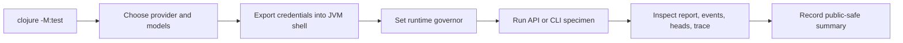

# Live Validation

Live validation proves that the runtime works with real providers. It is not the
default development gate, and it should never be required for routine offline
changes.

## When To Run It

Run live validation when a change touches:

- the SDK adapter or provider/model resolution;
- request assembly, streaming, retry, timeout, or cache options;
- recursive leaf or child execution;
- cost, usage, cache, or provider error normalization;
- durable behavior that only matters when real calls are in flight;
- prompt behavior that needs real model judgment rather than scripted replies.

For docs-only or deterministic runtime changes, `clojure -M:test` plus hygiene
checks is usually enough.

## Preflight

Before starting a live run:



1. Run the offline gate first:

   ```sh
   clojure -M:test
   ```

2. Decide the exact provider, root model, child model, and leaf model for this
   run. Prefer smaller or cheaper models for leaves when that still exercises
   the behavior under test.

3. Export provider credentials into the shell that will start the JVM. Do not
   rely on credentials loaded only into an editor, terminal profile, or separate
   process.

4. Use an ignored artifact directory for durable stores and reports. Relative
   paths under `.fractal/` or `runs/` are ignored by this repo.

5. Set the runtime governor explicitly: `:max-steps`, `:max-turns`,
   `:call-timeout-ms`, `:max-fanout`, `:fanout-pool`,
   `:leaf-concurrency`, and the hard context-window threshold.

## Running The Checked-In Suite

The checked-in opt-in suite is:

```sh
clojure -M:live-test
```

Interpret results carefully:

- Passed live tests prove the guarded provider path worked for the configured
  credentials and models at that time.
- Skipped live tests usually mean the required credentials were not visible to
  the JVM.
- Provider failures, rate limits, and quality regressions should be reported as
  live validation findings, not hidden as generic test flakiness.

Do not add live tests to the default `:test` alias.

## Manual Run Shape

For one-off live specimens, keep the config small and explicit. A typical shape:

```clojure
(require '[fractal.engine.api :as fe])

(def cfg
  (fe/make-config
    {:adapter :sdk
     :provider :provider-key
     :model "root-model-id"
     :harness :rlm
     :child-model "child-model-id"
     :leaf-model "leaf-model-id"
     :max-steps 8
     :max-turns 1
     :call-timeout-ms 60000
     :max-fanout 4
     :fanout-pool 2
     :store :sqlite
     :store/dir ".fractal/live-validation/run-id"}))

(def s (fe/start-session! cfg {:id "live-validation-run"}))
(def result (fe/run-turn! s "Return a small deterministic value via FINAL."))
(fe/close-session! s)
```

Replace provider and model placeholders with public provider identifiers that
exist in the SDK catalog or are explicitly supported by the local provider
configuration. Keep any credentials outside the repository.

## CLI Live Matrix

When the control plane changes, validate through the shipped CLI rather than
only through the Clojure API. Use an ignored artifact directory and an EDN config
profile:

```edn
{:default-profile :live
 :profiles
 {:live
  {:adapter :sdk
   :provider :provider-key
   :model "root-model-id"
   :harness :rlm
   :capability :default
   :store :sqlite
   :store/dir ".fractal/live-cli-validation/run-id/store"
   :child-model "child-model-id"
   :leaf-model "leaf-model-id"
   :max-steps 8
   :max-turns 8
   :call-timeout-ms 90000
   :max-fanout 4
   :fanout-pool 2
   :leaf-concurrency 2
   :cache-ttl "5m"}}}
```

A complete control-plane smoke should exercise every command at least once:

```sh
clojure -M:cli init --config .fractal/live-cli-validation/run-id/init.edn --store-dir .fractal/live-cli-validation/run-id/init-store --session init-session --force
clojure -M:cli config --config .fractal/live-cli-validation/run-id/fractal.edn --pretty

clojure -M:cli run --config .fractal/live-cli-validation/run-id/fractal.edn --session live-run --message-file messages/run.md
clojure -M:cli start --config .fractal/live-cli-validation/run-id/fractal.edn --session live-normal
clojure -M:cli turn --config .fractal/live-cli-validation/run-id/fractal.edn --session live-normal --message-file messages/turn-1.md
clojure -M:cli turn --config .fractal/live-cli-validation/run-id/fractal.edn --session live-normal --message-file messages/turn-2.md
clojure -M:cli resume --config .fractal/live-cli-validation/run-id/fractal.edn --session live-normal
clojure -M:cli compact --config .fractal/live-cli-validation/run-id/fractal.edn --session live-normal
clojure -M:cli wait --config .fractal/live-cli-validation/run-id/fractal.edn --session live-normal

clojure -M:cli status --config .fractal/live-cli-validation/run-id/fractal.edn --session live-normal
clojure -M:cli progress --config .fractal/live-cli-validation/run-id/fractal.edn --session live-normal
clojure -M:cli view --config .fractal/live-cli-validation/run-id/fractal.edn --session live-normal
clojure -M:cli events --config .fractal/live-cli-validation/run-id/fractal.edn --session live-normal --since 0
clojure -M:cli heads --config .fractal/live-cli-validation/run-id/fractal.edn --session live-normal
clojure -M:cli head --config .fractal/live-cli-validation/run-id/fractal.edn --session live-normal --head "$head_id"
clojure -M:cli messages --config .fractal/live-cli-validation/run-id/fractal.edn --session live-normal
clojure -M:cli turns --config .fractal/live-cli-validation/run-id/fractal.edn --session live-normal
clojure -M:cli steps --config .fractal/live-cli-validation/run-id/fractal.edn --session live-normal
clojure -M:cli evals --config .fractal/live-cli-validation/run-id/fractal.edn --session live-normal
clojure -M:cli trace --config .fractal/live-cli-validation/run-id/fractal.edn --session live-normal
clojure -M:cli check --config .fractal/live-cli-validation/run-id/fractal.edn --session live-normal
clojure -M:cli report --config .fractal/live-cli-validation/run-id/fractal.edn --session live-normal
clojure -M:cli close --config .fractal/live-cli-validation/run-id/fractal.edn --session live-normal
clojure -M:cli stop --config .fractal/live-cli-validation/run-id/fractal.edn --session live-normal

clojure -M:cli run --config .fractal/live-cli-validation/run-id/fractal.edn --session live-recursive --message-file messages/recursive.md
clojure -M:cli edges --config .fractal/live-cli-validation/run-id/fractal.edn --session live-recursive
clojure -M:cli tree --config .fractal/live-cli-validation/run-id/fractal.edn --session live-recursive

clojure -M:cli run --config .fractal/live-cli-validation/run-id/fractal.edn --session live-payload --message-file messages/payload.md
clojure -M:cli turns --config .fractal/live-cli-validation/run-id/fractal.edn --session live-payload --edn
clojure -M:cli payload --config .fractal/live-cli-validation/run-id/fractal.edn --session live-payload --ref "$payload_ref"
clojure -M:cli help
```

The assertions should prove more than command exit status:

- root turns return `:final`;
- a later `turn` observes REPL state from an earlier turn;
- a leaf call uses the configured leaf model path;
- a recursive run creates at least one lineage edge and `tree` sees at least two
  sessions;
- `compact` publishes a compaction head;
- `check` returns `ok true`;
- `trace` hydrates assistant code and observation messages for a turn;
- `payload` hydrates a content-addressed value from a ref returned by `turns`;
- `stop`, `close`, and `resume` work through durable reopen.

## SDK Surface Live Smoke

When changing `fractal.engine.surface`, capability gating, request assembly, or
leaf prompt wiring, run the focused surface live test instead of relying only on
generic recursion tests:

```sh
clojure -M:live-test -n fractal.engine.live-surface-test
```

The checked-in surface smoke uses a temporary Git-like repository surface and a
bounded task that asks the root model to:

- call the injected surface to enumerate files;
- call the injected surface to read bounded file contents;
- use a leaf call for one semantic classification;
- spawn a child that also uses the injected surface;
- return an EDN final value that exposes the root, leaf, and child results.

Useful assertions for manual or extended surface smokes:

- final status is `:final`;
- returned values contain data that could only come from the injected surface;
- at least one child invocation edge is recorded when the task asks for a child;
- leaf results reflect the configured leaf model path and leaf prompt context;
- denied surface functions are absent rather than prompt-discouraged;
- durable session metadata contains public surface stamps only;
- resume with the same descriptors succeeds, while missing or changed stamps fail
  with `:surface/mismatch`;
- any instrumented host-call counters prove that real surface functions executed.

## What To Record

A useful live validation note should include:

- command or REPL shape used;
- provider family and model roles, stated generically when the report will be
  public;
- explicit runtime governor values;
- whether credentials were visible to the JVM;
- pass, fail, or skip counts;
- final status and error type for failures;
- usage/cost/cache status when providers report it;
- relative artifact directory, if any;
- command matrix coverage when validating the CLI;
- cleanup status for ignored artifacts;
- public-safety scan results for any tracked report.

Do not include raw prompts, full transcripts, local credential paths, cloud
project identifiers, secret names, personal identifiers, or machine-specific
paths in tracked reports.

## Paid-Run Controls

Treat every live recursion run as potentially multiplicative. A root turn may
make additional provider calls through leaves, children, nested children, or
fan-out lanes.

Use the engine runtime governor deliberately:

- lower `:max-fanout` and `:fanout-pool` before raising model quality;
- set `:max-turns` for live sessions unless the scenario specifically tests
  multi-turn continuity;
- set `:max-steps` per turn and raise it only when a scenario requires
  multi-step REPL work;
- lower `:leaf-concurrency` when a provider or account is rate-limit sensitive;
- use `:call-timeout-ms` to bound provider stalls and retry loops;
- set a hard context-window threshold through `:context`;
- prefer small deterministic tasks for smoke tests;
- stop the session and close durable resources at the end of the run.

If a live scenario needs high fan-out, deep recursion, or multiple turns, record
the expected upper bound before starting the run.

The engine records usage and cost when providers report them, but those records
are observability metadata. The governor remains the execution controls above.
