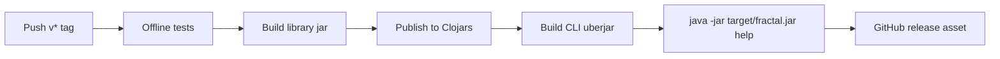

# Operations

This is the maintainer operations guide for `fractal-engine-v1`. The repo is a
library/runtime codebase; operational work means validating changes, managing
ignored artifacts, keeping tracked content public-safe, and recording enough
evidence for another maintainer to reproduce a result.

## Routine Maintenance Loop

For ordinary changes:

```sh
git status --short
clojure -M:test
git diff --check
```

For docs-only changes, the offline suite may be skipped when the change does not
alter behavior. In that case, still run `git diff --check` and public-safety
scans on the tracked diff.

For provider-facing changes, add opt-in live validation:

```sh
clojure -M:live-test
```

Run live validation only with credentials that are intentionally available to the
JVM and with explicit leashes.

For CLI/control-plane changes, validate through the shipped command seam:

```sh
clojure -M:cli help
clojure -M:cli config --config fractal.edn --pretty
clojure -M:cli run --config fractal.edn --session demo --message-file prompt.md --pretty
clojure -M:cli report --config fractal.edn --session demo --pretty
```

When the change affects live provider behavior or command semantics, run the
full live command matrix from [Live Validation](LIVE_VALIDATION.md) and keep raw
artifacts under an ignored relative directory.

## Artifact Policy

Keep generated or sensitive artifacts out of tracked files. The repository
already ignores common local outputs such as:

- `.fractal/`;
- `runs/`;
- `release-assets/`;
- `.env`;
- tool caches and build outputs.

Use ignored relative paths for live stores, temporary reports, and dogfood
specimens. If a result needs to be tracked, create a sanitized summary rather
than committing raw provider payloads, transcripts, logs, or local runtime
state.

Before publishing a summary, check that it contains no:

- credential values or secret names;
- local machine paths or usernames;
- personal names or email addresses;
- private organization or workplace terms;
- cloud project identifiers;
- auth file paths;
- ticket identifiers or internal repository names;
- raw provider transcripts that may contain private input.

## Public-Safety Scan

Use a broad scan before committing public docs or reports:

```sh
git status --short
git diff --check
git grep --untracked -n -E 'secret|token|password|api[_-]?key|credential|auth' -- .
git grep --untracked -n -E '[[:alnum:]._%+-]+@[[:alnum:].-]+\.[[:alpha:]]{2,}' -- .
git grep --untracked -n -E '(^|[^[:alnum:]_])/(Users|home|var/folders)/' -- .
```

Review matches manually. The scan is designed to overmatch so maintainers catch
mistakes before they become tracked history.

When reviewing generated reports, also inspect the staged diff directly:

```sh
git diff --cached
```

Do not rely only on file names; leaks often appear inside otherwise ordinary
Markdown or EDN summaries.

## Live Run Cleanup

After a live run:

1. Stop or close sessions through the API when the run created handles.
2. Confirm ignored artifacts are still ignored:

   ```sh
   git status --short --ignored
   ```

3. Delete local scratch artifacts when they are no longer needed.
4. If keeping a specimen for later analysis, keep it under an ignored relative
   directory and record only a sanitized tracked summary.

Do not move raw live artifacts into tracked docs to make a report easier to
review.

## Release Status

Release automation is tag-driven. A pushed `v*` tag runs
`.github/workflows/release.yml` at the tagged commit:



1. run the offline suite;
2. build the thin library jar;
3. publish the library jar to Clojars;
4. build and smoke-test the CLI uberjar;
5. create a GitHub release with `target/fractal.jar`.

Required repository secrets:

- `CLOJARS_USERNAME`
- `CLOJARS_PASSWORD`

The release version is derived from the tag name without the leading `v`.

Local package checks:

```sh
clojure -T:build jar
clojure -T:build uber
java -jar target/fractal.jar help
```

Do not push a release tag until the branch is intentionally ready to publish.
For ordinary branches or pull-request notes, report:

- offline suite command and result;
- package build command and result when packaging changed;
- optional live suite command and result, including skips;
- CLI command matrix result when the control plane changed;
- leash values for paid runs;
- artifact cleanup status;
- public-safety scan result;
- final `git status --short`.

## Incident Notes

When a validation run fails, record the smallest useful public-safe facts:

- command or REPL shape;
- status and error type;
- whether the failure was offline, live-provider, timeout, budget, or artifact
  integrity related;
- provider/model role only when safe to publish;
- whether retrying would spend money;
- exact tracked files changed by the follow-up fix.

Keep private run material in ignored local storage. Tracked incident notes should
be enough to reproduce the class of failure without exposing credentials,
private inputs, or machine-specific details.
