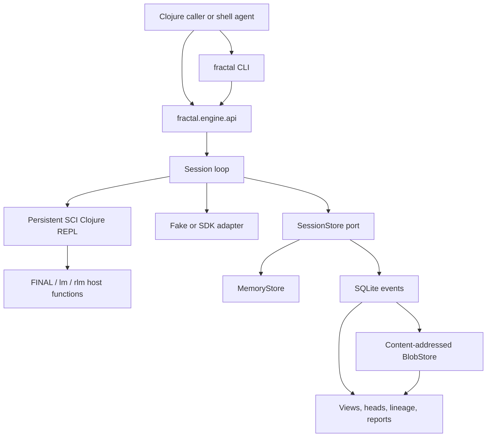

# fractal-engine Docs

fractal-engine is a recursive language-model compute engine for long-context,
long-horizon work. A root model drives a persistent Clojure REPL, writes fenced
Clojure, receives compact host observations, and continues until it calls
`(FINAL value)`.

The repository is best read as an engine SDK plus an agent-operable control
plane. The stable embedding surface is `fractal.engine.api`; the checked-in CLI
at `clojure -M:cli` sits above that API as a JSON-first, scriptable, resumable
control surface for agents under human supervision.

This is not a transcript-first chat loop or a consumer-facing application. It is
a durable working-state substrate: code for exact work, model calls for bounded
judgment, child sessions for recursive work, and immutable heads for revisiting
prior state.

## Who This Is For

Use this repo if you are building:

- agent runtimes that need durable, inspectable working state;
- recursive task systems where a root model can delegate bounded subproblems;
- SDK integrations around a small Clojure API;
- readback and audit tooling over session events, payload refs, heads, and
  lineage.

It is also useful for studying a minimal architecture for model-driven code eval
with explicit storage and capability boundaries.

## Capability Map



| Capability | Built surface |
| --- | --- |
| Session core | Persistent SCI-backed Clojure REPL, step loop, capability sandbox, fake/provider adapter seam, public API, live readback, and compaction. |
| Durable sessions | SQLite event store, content-addressed BlobStore payloads, and `resume-session!` over the same `SessionStore` port. |
| Recursive harness | Model-facing `lm`, `map-lm`, `rlm`, and `map-rlm` with fan-out, child sessions, capability inheritance, and config-only harness switching. |
| Durable state graph | Immutable content-addressed heads, current-head publication, invocation and derivation lineage edges, and `attach-rlm` for deriving a fresh child from a prior head. |
| Agent control plane | Non-interactive CLI usage and inspection commands, config files, JSON/EDN output, payload hydration, trace readback, store checks, and compact reports. |

The public namespace remains `fractal.engine.api` across both harness modes.
The recursive functions are injected into the model's session REPL; they are not
top-level API functions.

The command-line control plane is also built. It is a thin process seam over the
API with usage commands (`init`, `config`, `start`, `run`, `turn`, `resume`,
`stop`, `close`, `compact`, `wait`) and inspection commands (`status`,
`progress`, `view`, `events`, `heads`, `head`, `edges`, `tree`, `payload`,
`messages`, `turns`, `steps`, `evals`, `trace`, `check`, `report`). See
[Agent Control Plane](AGENT_CONTROL_PLANE.md).

## Mental Model

One turn follows one loop:

```mermaid
sequenceDiagram
  participant Caller
  participant Loop
  participant Model
  participant REPL as Session REPL
  participant Store

  Caller->>Loop: run-turn! / CLI run
  Loop->>Store: append user message and turn start
  Loop->>Model: request with kept transcript
  Model-->>Loop: assistant text with fenced Clojure
  Loop->>REPL: evaluate blocks
  REPL-->>Loop: eval records and FINAL status
  Loop->>Store: append assistant, evals, observation
  alt no FINAL yet
    Loop->>Model: next request with observation
  else FINAL
    Loop->>Store: snapshot vars and publish head
    Loop-->>Caller: TurnResult
  end
```

The session remains live after `FINAL`. Vars defined during earlier turns can be
used by later turns, and durable sessions can be closed and reopened from the
SQLite store.

In `:rlm` harness mode, the model can choose among three levels of work:

- deterministic Clojure in the current REPL;
- `lm` / `map-lm` for bounded leaf model calls with no child session;
- `rlm` / `map-rlm` for fresh child sessions that run their own loop to `FINAL`;
- `attach-rlm` to restore a selected immutable source head into a fresh derived
  child without advancing the source session.

## Quick Offline Taste

The fake adapter lets you exercise the API without provider credentials:

```clojure
(require '[fractal.engine.api :as fe])

(def cfg
  (fe/make-config
   {:adapter :fake
    :model "fake-model"
    :capability :default
    :fake/respond
    (fe/responder
     [[:default "```clojure\n(FINAL {:answer 42})\n```"]])}))

(def session (fe/start-session! cfg))
(def result (fe/run-turn! session "What is 6 times 7?"))

(:status result)
;; => :final

(:turn/final-value result)
;; => {:answer 42}

(fe/stop-session! session)
```

For a fuller walkthrough, including durable SQLite sessions and a small
recursive fake-adapter run, see [Getting Started](GETTING_STARTED.md).

## Quick CLI Taste

Create a config reference and run one offline fake-adapter turn:

```sh
clojure -M:cli init --config fractal.edn --store-dir .fractal/sessions/demo --session demo
clojure -M:cli run --config fractal.edn --session demo --message "return a small value" --pretty
clojure -M:cli report --config fractal.edn --session demo --pretty
```

The default CLI output is structured JSON. Use `--edn` when you need exact
Clojure-shaped refs, such as payload refs returned by `turns`.

## Repository Map

- [`README.md`](../README.md): concise repo-level orientation and examples.
- [`GETTING_STARTED.md`](GETTING_STARTED.md): offline API and CLI walkthrough.
- [`API.md`](API.md): supported `fractal.engine.api` functions and result
  contracts.
- [`AGENT_CONTROL_PLANE.md`](AGENT_CONTROL_PLANE.md): CLI command families,
  config files, output contract, and inspection workflows.
- [`ARCHITECTURE.md`](ARCHITECTURE.md): runtime layers, turn flow, recursion,
  storage authority, and failure semantics.
- [`STORAGE_AND_HEADS.md`](STORAGE_AND_HEADS.md): SQLite/BlobStore authority,
  payload refs, folded views, immutable heads, and lineage edges.
- [`RECURSION.md`](RECURSION.md): how to choose Clojure, leaf calls, child
  calls, fan-out, and attach.
- [`LONG_HORIZON_WORK.md`](LONG_HORIZON_WORK.md): how to shape durable
  multi-turn work.
- [`TESTING.md`](TESTING.md): offline gate, optional live validation, packaging
  checks, and public-safety scans.
- [`LIVE_VALIDATION.md`](LIVE_VALIDATION.md): provider-backed validation and CLI
  live matrix.
- [`OPERATIONS.md`](OPERATIONS.md): maintenance, artifacts, release automation,
  and incident notes.
- [`src/fractal/engine/api.clj`](../src/fractal/engine/api.clj): supported SDK
  facade.
- [`src/fractal/engine/cli.clj`](../src/fractal/engine/cli.clj): agent-operable
  CLI/control plane over the SDK API.
- [`src/fractal/engine/`](../src/fractal/engine/): implementation namespaces for
  sessions, storage, recursion, adapter ports, payload IO, compaction, and live
  readback.
- [`test/fractal/engine/`](../test/fractal/engine/): offline proof suite,
  including fake-adapter, storage, recursion, heads, and lineage tests.
- [`spec/`](../spec/): detailed design record, including build history and
  lower-level implementation rationale.

## What It Intentionally Does Not Build

- No end-user terminal product or chat UI; the CLI is an agent control plane,
  not a human-first application shell.
- No provider SDK: provider networking stays behind the adapter seam.
- No hidden model context object: the model sees ordinary Clojure plus explicit
  injected host functions.
- No filesystem-shaped semantic API: paths under a store directory are backend
  details; the logical identifiers are session ids, payload ids, head ids, and
  lineage-edge ids.
- No public fork-session lifecycle API in v1.
- No total spend governor or alternate durable index in the core v1 scope.

## Read Next

Start with [Getting Started](GETTING_STARTED.md) to run the fake adapter and see
the SDK shape. Then read [`spec/README.md`](../spec/README.md), especially
`00`, `01`, `02`, `06`, and `12`, when you need the detailed architecture and
model-facing doctrine.
