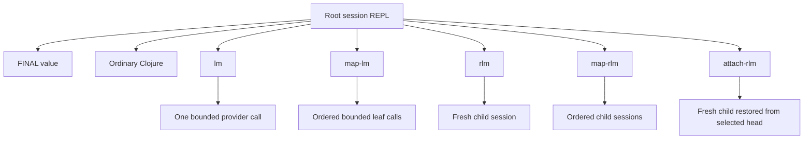

# Recursion Semantics

fractal-engine is a recursive language-model compute engine for long-context,
long-horizon work. A root session keeps working state across turns. The model writes
Clojure, the host evaluates it in a persistent SCI context, and the turn ends only
when the model calls `FINAL`.

Recursion is not a separate API surface or scoring mode. It is the engine's way to
split work while preserving durable state, bounded delegation, and an auditable
state graph.

## Model-Facing Surface

The recursive harness gives the model ordinary Clojure plus this small surface:

| Function | Use it for |
| --- | --- |
| `FINAL` | Return the current turn's value and close the turn. |
| `lm` | Make one bounded semantic leaf call over one bounded input. |
| `map-lm` | Run independent bounded leaf calls in parallel, preserving input order. |
| `rlm` | Start one fresh child session for a sub-problem that needs its own loop. |
| `map-rlm` | Start independent child sessions in parallel for naturally separate lanes. |
| `attach-rlm` | Derive a fresh child from a selected prior session/head and run one new task there. |

Everything else is engine machinery. Model code should not depend on hidden context,
ambient mutable session objects, or storage paths.

## Choose The Smallest Sufficient Kind

Use deterministic Clojure for exact work:

- parsing, filtering, joining, sorting, grouping, counting, and numeric aggregation
- schema checks, consistency checks, and final shape construction
- merging leaf or child results into one answer
- verifying that a proposed `FINAL` follows from observed values

Use `lm` or `map-lm` when the work needs one bounded semantic judgment:

- classify one bounded item
- extract a small structured value from a bounded text
- compare a bounded input against a clear rubric
- label many independent bounded items with `map-lm`

Leaves do not get a REPL, persistent vars, child lineage, or a multi-step loop. A
leaf is one provider call. If the task needs exploration, inspection, repair, or
multi-step state, it is not a leaf.

Use `rlm` or `map-rlm` when a sub-problem needs its own working loop:

- the lane has too much uncertainty for one leaf judgment
- the lane needs local representation, intermediate checks, or retries
- several branches can be explored independently before the root reconciles them
- the child may need to recurse again inside its assigned boundary

Children are full sessions. Each child has its own persistent SCI context, its own
turn loop, inherited-and-clamped capability, durable heads, and lineage back to the
caller. The parent receives an envelope and should read the child result from the
envelope value, then validate and aggregate in Clojure.

## Branches, Children, And State

The root session is the operator-steered working state. It can build maps, ledgers,
drafts, checks, partial answers, and assumptions over many turns. Later turns resume
from the current head and can continue from that state without replaying completed
work.

Child sessions are branches. A child should receive:

- the exact material or handles it owns
- the specific question it must settle
- the value shape it must return through `FINAL`
- the missingness rules for incomplete evidence
- the boundary that tells it what not to solve

Child outputs are claims, not facts. Before a root composes load-bearing claims, it
should re-ground them against returned data or source material, recompute exact
totals locally, and carry explicit missingness when a lane failed or returned weak
evidence.

For map calls, partial fan-out failures are values. A failed slot is represented as
an index-aligned sentinel such as `{:fractal/failed true ...}` while successful slots
remain available. Split successes from sentinels before aggregating; one failed lane
should not erase the rest of the batch.

## Attach Is Derived Continuation

`attach-rlm` is for reusing useful prior cognitive state without mutating it. It
selects a source session/head, restores that selected immutable head into a fresh
child, runs one new task in the child, and records a derivation edge.

It is different from nearby concepts:

| Concept | Meaning |
| --- | --- |
| Resume | Reopen the same durable session from its authoritative current head. |
| Fork | Start a separate logical branch from a selected head. |
| Continuation | Informal description of continuing a line of thought. It is not a storage primitive. |
| Attach | Create a fresh derived child from selected source state without advancing the source. |

The source session does not move under attach. Passing a session handle means
"attach from that session's current head." Passing a head handle means "attach from
this exact immutable point." That distinction matters when a later current head has
moved past an older useful branch.

Use attach when:

- a prior child built a representation that is expensive or fragile to rebuild
- a branch reached a useful but incomplete state and needs a new task
- the root wants to explore an alternate next step from a settled prior head
- an operator wants to preserve the old branch while deriving fresh work from it

Do not use attach to hide mutation, replay old provider calls, or make the source
session appear to have continued in place.

## Practical Patterns

Represent before delegating. Build a Clojure value that describes the work units,
their ids, expected counts, and boundaries. Use that value as the source of child
tasks and as the ledger for final aggregation.

Delegate with contracts. A child task should ask for a concrete value, not a general
analysis. Prefer "return `{:id id :answer value :evidence [...] :missing [...]}`" to
"look into this."

Rejoin deterministically. After `map-lm` or `map-rlm`, aggregate with ordinary
Clojure. Sort by stable ids, count successes and failures, validate shapes, and only
then construct `FINAL`.

Keep branch state meaningful. A child is justified when the branch's own state helps
settle the problem. If a child would only run one bounded read, use a leaf. If it
would only run one exact expression, use Clojure.

Attach from named evidence. Keep handles or returned envelopes for useful heads so a
later turn can derive from them directly instead of asking the model to remember a
prose summary.

## Anti-Patterns

- Using recursion to prove that recursion works.
- Sending exact arithmetic, parsing, or counting to a leaf or child.
- Creating a child whose task has no material boundary or return shape.
- Treating a child summary as verified evidence.
- Aggregating map results without separating failure sentinels.
- Recomputing a prior branch when a selected head can be attached.
- Assuming attach advances the source session.
- Treating resume as replay of old model calls or old evals.
- Depending on storage paths or hidden host state in model-written Clojure.

## What Good Recursion Looks Like

Good recursive work is boring at the join point. The root has a ledger. Each branch
owns a bounded lane. Leaves make bounded judgments. Children return exact shapes.
Failures are explicit values. The root validates, reconciles, and returns one compact
`FINAL` built from observed state rather than expectation.
