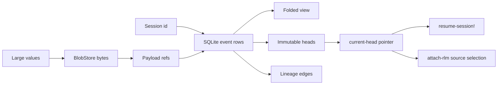

# Storage and Heads

This document describes fractal-engine-v1 storage authority, payload refs,
folded views, heads, lineage, and failure semantics. It is written for public
maintainers and contributors.

## Authority Model

The v1 runtime separates durable truth from projections:



1. SQLite is canonical for durable session rows and per-session event rows when
   `:store :sqlite` is selected.
2. BlobStore is canonical for content-addressed payload bytes.
3. `MemoryStore` implements the same `SessionStore` contract for in-process and
   test use.
4. The session view is a pure fold over events.
5. `current-head` is the authoritative continuation pointer for resume and
   attach semantics.
6. Filesystem paths are physical backend locations only. They are not session,
   head, payload, or lineage identity.

The durable SQLite layout is intentionally small: one database for session and
event rows, plus a sharded BlobStore for payload bytes. The path passed as
`:store/dir` chooses where those physical files live; it does not participate in
semantic identity.

## SessionStore Port

All runtime storage goes through `fractal.engine.store/SessionStore`:

```clojure
(defprotocol SessionStore
  (create-session! [store session-map])
  (append-event! [store sid event])
  (append-events! [store sid events])
  (publish-head! [store sid head])
  (append-lineage-edge! [store sid edge])
  (intern-payload! [store value opts])
  (read-payload* [store ref])
  (current-view [store sid])
  (read-state [store sid])
  (peek-next-id [store sid counter-key])
  (notify-transient [store sid item])
  (subscribe! [store sid callback])
  (events-since [store sid event-id]))
```

Important contract points:

- `create-session!` is idempotent. Re-creating an existing session returns the
  existing slot/handle and does not clear state.
- SQLite `create-session!` can reopen a persisted session by folding its durable
  event log into a fresh in-process view.
- `append-event!` stamps event id, timestamp, and any entity id assigned by the
  event type.
- `append-events!` stamps consecutive ids and commits the batch atomically.
- `publish-head!` computes immutable head content under the same per-session
  store lock as event appends.
- `current-view` is the strong read-your-writes runtime projection.
- `read-state` is a relaxed external-reader hook; the current implementations
  return the folded cache.

## Folded View

The view shape from `empty-view` is:

```clojure
{:session   nil
 :messages  []
 :turns     []
 :steps     []
 :evals     []
 :heads     []
 :current-head nil
 :edges     []
 :counters  {:event 0 :message 0 :turn 0 :step 0 :eval 0}
 :vars-ref  nil
 :compact-from-event-id nil
 :error     nil
 :events    []}
```

The view is not stored as a competing authority. It is rebuilt by applying
`apply-event` over the event stream. SQLite recovery depends on this property:
closing and reopening a store reconstructs the same session view by folding the
durable log.

Projection fields have clear roles:

- `:events` is the ordered event stream folded so far.
- `:counters` tracks the max assigned ids for events and entities.
- `:heads` stores immutable head records.
- `:current-head` stores only the selected head id.
- `:edges` stores folded lineage edges.
- `:vars-ref` is the latest vars snapshot projection/fallback.
- `:compact-from-event-id` controls transcript pruning.

## Event Taxonomy

Every durable state change is an event:

| Event type | Fold effect |
|------------|-------------|
| `:session/started` | Sets the session entity. |
| `:turn/started` | Appends a turn entity. |
| `:turn/put` | Replaces the matching turn by `:turn/id`. |
| `:step/started` | Appends a step entity. |
| `:step/put` | Replaces the matching step by `:step/id`. |
| `:message/appended` | Appends a transcript message. |
| `:eval/added` | Appends an eval record. |
| `:session/vars-snapshotted` | Updates `:vars-ref`. |
| `:session/compacted` | Updates `:vars-ref`, updates the compaction boundary, and appends one compact message. |
| `:head/published` | Adds a head and sets `:current-head`. |
| `:lineage/edge-added` | Adds a lineage edge. |
| `:session/stop-requested` | Sets session status to `:stop-requested`. |
| `:session/stopped` | Sets session status to `:stopped`. |
| `:session/error` | Stores `:error` and sets session status to `:error`. |

All stamped durable events are appended to `:events`. `.../put` events are value
replacement events, not patches. Events carry results, never recipes; folding
must not replay provider calls or evals.

Transient live items such as `:delta/token` and `:subscribe/gap` are not durable
events. They do not receive `:event/id` and do not fold into the view.

## Payload Refs

Values are stored inline when they are small enough and content-addressed when
they are large. The current inline threshold is 512 canonical bytes.

A payload ref is an opaque tagged map:

```clojure
{:fractal/ref  :payload
 :payload/id   "sha256:<hex>"
 :payload/kind :message | :eval-result | :final | :vars | :code | :request
 :payload/size 1234}
```

The hashing basis is `fractal.engine.payload/canonical-bytes`: deterministic
EDN bytes with sorted maps/sets and stable printing. The same value produces the
same `sha256:` id across MemoryStore and BlobStore.

Payload rules:

- Blob writes happen before events that reference them.
- Identical payload values deduplicate to the same content node.
- `read-payload` passes non-ref values through unchanged and dereferences tagged
  refs.
- Request assembly and compaction hydrate messages through the payload seam.
- Orphan blobs are acceptable after a failed or abandoned operation.
- Dangling refs are invalid and are detectable with `verify-no-dangling-refs`.

## Head Records

A head is an immutable content-addressed continuation boundary:

```clojure
{:head/id           "sha256:..."
 :head/version      1
 :head/session      "s-..."
 :head/basis        nil | "sha256:..."
 :head/event-range  [from-event-id to-event-id]
 :head/kind         :turn-final | :compaction
 :head/turn-id      1 | nil
 :head/vars-ref     <inline-value-or-payload-ref>
 :head/final-ref    <inline-value-or-payload-ref> | nil
 :head/compact-from-event-id nil | 42}
```

`publish-head!` derives:

- `:head/basis` from the folded current head before publication
- `:head/event-range` from the previous current head range to the requested
  boundary event
- `:head/id` from the canonical content of the head without `:head/id`

Publishing a head appends a `:head/published` event and sets `:current-head`.
The current head pointer is the mutable authority. The head content itself is
immutable.

## When Heads Are Published

Successful `FINAL` turn:

1. Snapshot SCI vars.
2. Append `:session/vars-snapshotted`.
3. Append final `:turn/put`.
4. Publish a `:turn-final` head whose event range ends at the final `:turn/put`.

Compaction:

1. Summarize kept messages into one continuation frame.
2. Snapshot vars.
3. Append one `:session/compacted` event.
4. Publish a `:compaction` head whose event range ends at the compaction event.

Non-final terminal outcomes do not publish heads. They still append terminal
turn state so the durable event stream and view represent the failure.

## Current Head and Resume

`resume-session!` for SQLite:

1. Opens a fresh store on the configured durable backend.
2. Recreates the in-process slot by folding durable events.
3. Builds a fresh SCI context.
4. Restores vars from the folded current head's `:head/vars-ref`.
5. Falls back to the top-level `:vars-ref` projection only if no current head is
   available.

This priority is deliberate. `:vars-ref` is useful projection state, but it is
not a second mutable restore authority. If a later vars snapshot projection
exists after a published head, resume still prefers the current head.

## Attach Semantics

`attach-rlm` is derivation, not in-place resume.

Source resolution:

- A source session handle or session id selects that session's `current-head`.
- A head map or explicit `:head/id` selects that immutable head.
- The selected source session and source head must exist.

Execution:

1. Create a fresh attached child session in the same store.
2. Clamp capability by both the caller and source profile.
3. Restore the child's SCI vars from the selected source head's `:head/vars-ref`.
4. Run the requested task in the child.
5. Publish the child's own head on `FINAL`.
6. Record a `:derivation` lineage edge.

The source session is not advanced. The source head is immutable and remains a
historical continuation boundary.

## Lineage Edges

Lineage edges are durable, content-addressed facts:

```clojure
{:edge/id           "sha256:..."
 :edge/version      1
 :edge/type         :invocation | :derivation
 :edge/from-session "s-..."
 :edge/to-session   "s-..."
 :edge/from-head    "sha256:..."
 :edge/to-head      "sha256:..."
 ...}
```

`rlm` and `map-rlm` children record `:invocation` edges from the parent current
head to the child current head. `attach-rlm` records a `:derivation` edge from
the selected source head to the attached child's current head.

Edges fold into the caller/parent view under `:edges`. They should be treated as
durable graph facts, not reconstructed from directory names, child session ids,
or other physical layout details.

## Compaction and Kept Messages

Compaction is a durable state transition, not a destructive rewrite.

`kept-messages` derives the transcript from the event stream:

- It scans `:events`.
- It keeps message-bearing events: `:message/appended` and
  `:session/compacted`.
- If a compaction boundary exists, it keeps messages whose event id is greater
  than or equal to `:compact-from-event-id`.

This is why the compact continuation frame survives pruning. The projection is
computed over events instead of mutating the historical `:messages` vector.

## Failure Semantics

SQLite persist-before-fold:

- Single appends insert the event row before folding into the view cache.
- Failed inserts throw before the view changes.
- Batch appends run in one transaction; a mid-batch failure rolls back and folds
  nothing.

Head publication:

- Optional `:head/expected-basis` is checked against the folded current head.
- A stale expected basis throws a typed head CAS failure.
- The store does not silently move `current-head` over an unexpected basis.

Payload refs:

- A missing blob dereferences to nil at the BlobStore level.
- Dangling refs in a folded view violate the storage invariant.
- Payload writes can safely orphan content because no event refers to it unless
  the later event append succeeds.

Live delivery:

- Durable events remain recoverable through `events-since`.
- Transient token deltas may be dropped under load.
- A `:subscribe/gap` marker tells subscribers to recover from durable events.

Turn outcomes:

- `:final` publishes a head.
- `:timeout`, `:budget-exceeded`, `:error`, and stopped-session results settle
  the turn without publishing a new head.

## Maintainer Checklist

When changing storage, heads, compaction, resume, or recursion:

1. Keep SQLite event rows plus BlobStore payloads as the durable authority.
2. Keep `apply-event` pure and deterministic.
3. Keep `current-view` read-your-writes for runtime code.
4. Keep `current-head` the sole mutable restore pointer.
5. Keep `:vars-ref` as projection/fallback state.
6. Keep head and edge ids content-addressed.
7. Keep attach additive and source-preserving.
8. Keep filesystem paths out of logical identity.
9. Prove MemoryStore and SqliteStore still satisfy the shared port contract.
10. Prove SQLite failures do not advance folded state.

## Verification Pointers

The current storage model is exercised by:

- `src/fractal/engine/store.clj`
- `src/fractal/engine/store/memory.clj`
- `src/fractal/engine/store/sqlite.clj`
- `src/fractal/engine/store/blobstore.clj`
- `src/fractal/engine/payload.clj`
- `src/fractal/engine/payload_io.clj`
- `src/fractal/engine/session.clj`
- `src/fractal/engine/session_loop.clj`
- `src/fractal/engine/compaction.clj`
- `src/fractal/engine/recursion.clj`
- `test/fractal/engine/store_test.clj`
- `test/fractal/engine/store_contract_test.clj`
- `test/fractal/engine/store_sqlite_test.clj`
- `test/fractal/engine/blobstore_test.clj`
- `test/fractal/engine/payload_test.clj`
- `test/fractal/engine/payload_io_test.clj`
- `test/fractal/engine/session_test.clj`
- head and lineage regression tests under `test/fractal/engine/`
