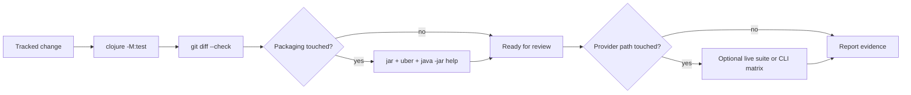

# Testing

This document is the maintainer testing guide for `fractal-engine`. The
default rule is offline-first: routine validation must not require credentials,
network access, or paid provider calls.

## Default Gate

Run the offline suite before merging runtime, storage, adapter, prompt, or public
API changes:



```sh
clojure -M:test
```

The `:test` alias excludes tests marked `^:live`, so this command is expected to
run without provider credentials. It covers the deterministic engine path:

- sandbox and capability boundaries;
- request construction, prompt/cache shape, observations, and payload hydration;
- memory and durable store behavior;
- turn loop, step limits, timeout mapping, and async behavior;
- public API reads and subscriptions;
- CLI config parsing, JSON/EDN output, usage commands, inspection commands, and
  durable payload hydration through the command surface;
- recursive host functions, fan-out behavior, partial failure sentinels, resume,
  attach, and lineage invariants;
- SDK surfaces: descriptor validation, capability gates, SCI namespace
  injection, prompt cards, dynamic request/leaf prompt placement, child
  inheritance, durable resume stamp matching, and concrete Git-like recursion
  with leaves and children;
- namespace layering through the acyclicity test.

Run the patch hygiene check for every documentation or source change:

```sh
git diff --check
```

For packaging or release workflow changes, also build both artifacts and smoke
the CLI jar:

```sh
clojure -T:build jar
clojure -T:build uber
java -jar target/fractal.jar help
```

## Optional Live Suite

Live-provider validation is opt-in:

```sh
clojure -M:live-test
```

The `:live-test` alias includes only tests marked `^:live`. These tests are
credential-guarded and may skip when provider credentials are absent. A skipped
live test is useful information about local setup; it is not the same as
evidence that the provider path is healthy.

Use live validation to prove the real adapter path, provider authentication,
real model responses, recursive child or leaf calls, and honest usage/cost/cache
reporting. Keep it separate from the default gate because it can be slow,
flaky for provider reasons, and paid.

For CLI/control-plane changes, also run a live command matrix through
`clojure -M:cli` as described in [Live Validation](LIVE_VALIDATION.md). A
complete matrix should exercise usage commands, inspection commands, recursive
tree readback, trace readback, compaction, stop/close/reopen behavior, and
payload hydration from a stored ref.

For SDK surface changes, the focused live path is:

```sh
clojure -M:live-test -n fractal.engine.live-surface-test
```

That test uses a real provider, a real configured Git-like surface, a root
session, a child session, and a leaf call. It proves that injected host
functions can be selected by the model and that surface prompt context reaches
the relevant request paths.

## Runtime Governor For Live Runs

Every live run should be bounded in config. The relevant runtime keys are:

- `:max-steps` for per-turn step count;
- `:max-turns` for total turns in a session;
- `:call-timeout-ms` for the wall-clock deadline around each adapter call;
- `:max-fanout` for maximum `map-lm` / `map-rlm` lanes accepted by one call;
- `:fanout-pool` for bounded fan-out worker threads.
- `:leaf-concurrency` for the process-wide leaf-call semaphore;
- `:context` hard threshold for context-window exhaustion.

For paid validation, start with small values and raise only for the specific
scenario under test. A live proof that needs high limits should say why those
limits are necessary and what signal would indicate a runaway run.

These controls bound execution and produce explicit terminal statuses. Provider
usage/cost records, when available, are observability metadata for audit and
reporting.

## Environment Handling

Provider SDKs may read credentials from environment variables. Export those
variables in the same shell that launches the JVM:

```sh
export PROVIDER_API_KEY=...
clojure -M:live-test
```

Use provider-specific variable names required by the SDK in your local shell or
secret manager. Do not commit credential values, local credential file paths, or
machine-specific setup notes.

## Public-Safety Checks

Before publishing docs or generated artifacts, scan the changed files for
secrets and local identifiers:

```sh
git status --short
git diff --check
git grep --untracked -n -E 'secret|token|password|api[_-]?key|credential|auth' -- .
git grep --untracked -n -E '[[:alnum:]._%+-]+@[[:alnum:].-]+\.[[:alpha:]]{2,}' -- .
git grep --untracked -n -E '(^|[^[:alnum:]_])/(Users|home|var/folders)/' -- .
```

These scans are intentionally broad. Review matches manually; many legitimate
matches are documentation about what not to commit.

## Long-Horizon Dogfood Specimens

Use long-horizon specimens when the change needs evidence beyond deterministic
unit tests. Useful specimens should cover:

- many-turn continuity with persistent working state;
- stop, close, resume, and continue from durable state;
- branch, attach, or host-fork from a prior head without advancing the source;
- abort a turn (budget/timeout) and recover its state from the wreckage head;
- child and leaf decomposition under explicit fan-out and timeout limits;
- agent-driven CLI usage with human-observed JSON or EDN artifacts;
- partial failure where other lanes still produce usable results;
- artifact growth over time, including payload hydration and missing/corrupt
  blob behavior;
- live-provider cost and usage envelopes, reported without assuming all
  providers return complete accounting;
- a public-safe final report containing commands, limits, run identifiers, skipped
  tests, artifact locations, and cleanup status.

Keep raw transcripts, provider payloads, local run directories, and credentials
out of tracked files. Summaries should be sanitized and reproducible enough for
another maintainer to rerun the scenario with their own credentials.
